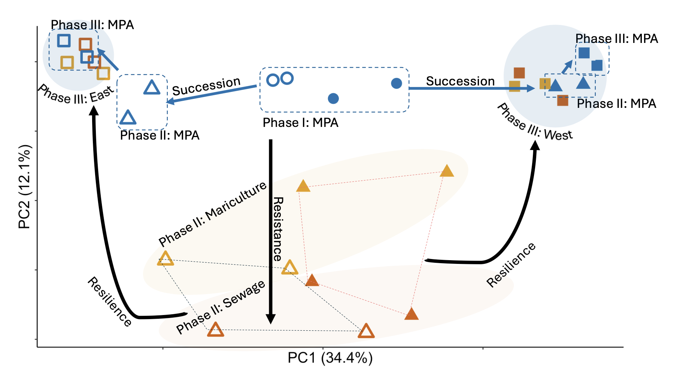

# Autonomous Reef Monitoring Structures (ARMS) Reveal Human-Induced Biodiversity Shifts in Urban Coastal Ecosystems

#### Zhongyue Wan 1,2, Isis Guibert 1,2, Wing Yi Haze Chung 1,2,4, Charlotte Ho 1,2,5, Alison Corley 1,2, Emily Chei 1,2, Inga Conti-Jerpe 6 , Jonathan D. Cybulski 1,2, Joseph Brennan 1,2, Ling Fung Matt Chan 1,2, Philip Thompson 1,2, Róisín Hayden 1,2, Shan Yee Joyce Lee 1,2, Wan Ching Rachel Au 1,2, Wendy McLeod 1,2, David M. Baker 1,2,*  &amp; Shelby E. McIlroy 1,2,3,* 

1 The Swire Institute of Marine Science, The University of Hong Kong, Cape D’Aguilar Road, Shek O, Hong Kong SAR  
2 School of Biological Sciences, The University of Hong Kong, Pok Fu Lam, Hong Kong SAR  
3 Simon F. S. Li Marine Science Laboratory, School of Life Sciences, The Chinese University of Hong Kong, Shatin, Hong Kong SAR  
4 Department of Biology, University of Oxford, Oxford, UK  
5 Tree of Life, Wellcome Sanger Institute, Hinxton, Cambridge, UK  
6 Lingnan University, Tuen Mun, Hong Kong SAR  

`*` Corresponding author

## Abstract 

 

Biodiversity thrives in coastal marine habitats which host foundational species such as corals, mangroves, and seagrasses. However, coastal development and the growth of megacities along shorelines impose an array of stressors on the marine environment. These stressors inevitably impact biodiversity which dictates ecosystem functions and services. Despite extensive research on biodiversity responses to anthropogenic stressors, phylum-specific resistance and resilience dynamics – particularly in coastal marine ecosystems – remain poorly understood. Considering the global scale of coastal development, it is imperative to develop a more comprehensive understanding of how biodiversity, in terms of richness and community composition, is influenced by various anthropogenic stressors. Here, we present the first application of standardized Autonomous Reef Monitoring Structures (ARMS) as an experimental unit - using a common garden experimental design - to examine community responses to stress within an urbanized seascape. ARMS were seeded within two marine reserves for one year and then transplanted to sites of stress, including domestic sewage, and mariculture. We hypothesized that 1) human impacts reduce richness and alter composition of established communities; and 2) increasing intensity of these impacts reduces community resistance and resilience to stress. Using metabarcoding, we quantified richness and taxonomic composition and assessed their changes along an impact gradient. Our results showed that nutrient pollution, particularly inorganic nitrogen, significantly reduced species richness and restructured communities. Communities exhibited low resistance, yet high resilience - suggesting that urbanized seascapes have high recovery potential when stress is mitigated. 

For more details, please refer to the [preprint_pending](link)   

## Table of Contents

### Supporting Materials 
  1. [Raw sequence](https://doi.org/10.6084/m9.figshare.29481053) 
  2. [Data](3_data)
  3. [Figures](2_figure/merge_figure_250703.pdf)
  4. [Tables](2_figure/merge_table_250703.pdf)
  5. [Supplementary Materials](2_figure/250711_supplementaryMaterials.pdf)

### Sequence processing pipeline 
1. [Import & cutadap](https://github.com/zhongyuewan/MGEXP1/blob/main/1_code/1.1_importAndCutAdapt.sh): import raw sequence data (.fastq) into Qiime artefacts (.qza) and remove PCR adaptors.
2. [Denoise-paired](https://github.com/zhongyuewan/MGEXP1/blob/main/1_code/1.2_denoiseAndPair.sh): remove sequences likely induced by error and merge the reverse/forward reads.
3. [Decontam](https://github.com/zhongyuewan/MGEXP1/blob/main/1_code/1.3_decontam.r): a process to look into the negative control and remove sequences that might have come from sample contamination.
4. [Amino Acid translation](https://github.com/zhongyuewan/MGEXP1/blob/main/1_code/1.4_aaTranslate.r): translate DNA sequence into amino acid and remove sequences with one of the following conditions: 1) any STOP codon, 2) >3 deletion, 3) any frameshift, 4) any insertion.
5. [Cluster all sequences](https://github.com/zhongyuewan/MGEXP1/blob/main/1_code/1.5_clusterReads.sh) by 97% similarity into operational taxonomic units (OTUs) for downstream data analysis.
6. [Taxonomic assignment](https://github.com/zhongyuewan/MGEXP1/blob/main/1_code/1.6_taxAssign.sh) with BLAST against two different libraries: 1) McIlroy et al. 2024 & 2) Medori2 (GB260).

### Data Analysis 
1. Environmental data
   - [Heatmap](https://github.com/zhongyuewan/MGEXP1/blob/main/1_code/2.1_eData_heatmap.r) (Figure 1d, Table 1)
   - [MPA east vs west](https://github.com/zhongyuewan/MGEXP1/blob/main/1_code/2.2_eastVSwest.r) (Table S4)
2. Species richness by ARMS 
   - [Merge richness from all three fractions](https://github.com/zhongyuewan/MGEXP1/blob/main/1_code/2.3_combinFractionbyARMS.r) (Table S2)
   - [Environmental data ~ species richness](https://github.com/zhongyuewan/MGEXP1/blob/main/1_code/2.4_eDATAvsRichness.r) (Table 2) 
3. Community composition
   - [PCoA](https://github.com/zhongyuewan/MGEXP1/blob/main/1_code/2.5_PCoA.r) (Figure 2)
   - [Permutational Multivariate Analysis of Variance (adonis2)](https://github.com/zhongyuewan/MGEXP1/blob/main/1_code/2.6_adonis2.r) 
   - [Ternary plot](https://github.com/zhongyuewan/MGEXP1/blob/main/1_code/2.7_ternary.r) (Figure S2)
   - [Horizontal barplot](https://github.com/zhongyuewan/MGEXP1/blob/main/1_code/2.8_sidewayBar.r) (Figure 3a)
   - [Resistance composition](https://github.com/zhongyuewan/MGEXP1/blob/main/1_code/2.9_resistanceComposition.r)(Figure 3b)
4. Succession
   - [Total richness and by phyla](https://github.com/zhongyuewan/MGEXP1/blob/main/1_code/2.10_succession.r) (Figure 4, Table S2)
     
