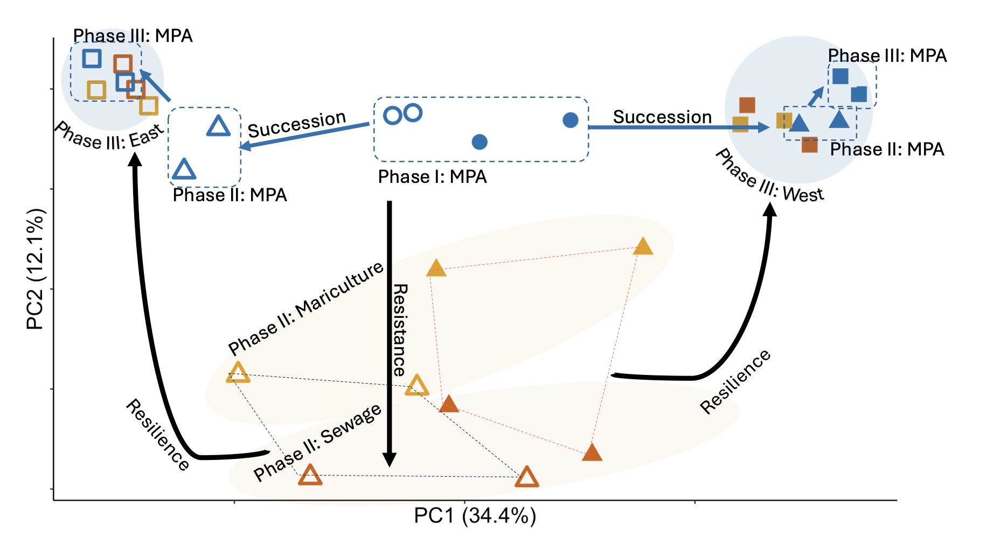

# Low Resistance but High Resilience of Marine Invertebrate Communities to Urban Stressors

#### author list hidden for double-anonymised review 

## Abstract 

 

Urbanization and the global growth of coastal megacities impose an array of stressors on nearby marine ecosystems impacting biodiversity and ecosystem services. Despite extensive research on biodiversity responses to anthropogenic stressors, community level resistance and resilience dynamics – particularly in coastal marine ecosystems – remain poorly understood. In the first application of standardized Autonomous Reef Monitoring Structures (ARMS) as an experimental unit – using a modified common garden experimental design – we examined community-level responses to stress within an urbanized seascape. ARMS that were seeded with natural communities within marine reserves, accumulating ~1,300 OTUs per unit, across 30 phyla, were transplanted to sites of stress, including domestic sewage discharge and mariculture. We hypothesized that COI metabarcoding of ARMS communities would show that 1) low community resistance to anthropogenic stress led to declines in species richness and compositional shifts and 2) chronic exposure to stressors reduces community resilience following stress removal. We found treatment specific responses and an overall impact of nutrient pollution, particularly total inorganic nitrogen, in significantly reducing species richness and altering community structure. Yet, when ARMS were returned to marine reserves, community composition reverted to similarity with ARMS not exposed to stress, accounting for succession. This community-level pattern of low resistance but high resilience highlights the recovery potential of highly connected marine ecosystems and underscores the value of stress mitigation in urbanized seascapes.

## Table of Contents

### Supporting Materials 
  1. [Raw sequence](https://doi.org/10.6084/m9.figshare.29481053) 
  2. [Data](3_data)
  3. [Figures](2_figure/260304_mergeFigure.pdf)
  4. [Tables](2_figure/260304_mergeTable.pdf)
  5. [Supplementary Materials](2_figure/260305_supplementaryMaterials_FIN.docx)

### Sequence processing pipeline 
1. [Import & cutadap](https://github.com/zhongyuewan/MGEXP1/blob/main/1_code/1.1_importAndCutAdapt.sh): import raw sequence data (.fastq) into Qiime artefacts (.qza) and remove PCR adaptors.
2. [Denoise-paired](https://github.com/zhongyuewan/MGEXP1/blob/main/1_code/1.2_denoiseAndPair.sh): remove sequences likely induced by error and merge the reverse/forward reads.
3. [Decontam](https://github.com/zhongyuewan/MGEXP1/blob/main/1_code/1.3_decontam.r): a process to look into the negative control and remove sequences that might have come from sample contamination.
4. [Amino Acid translation](https://github.com/zhongyuewan/MGEXP1/blob/main/1_code/1.4_aaTranslate.r): translate DNA sequence into amino acid and remove sequences with one of the following conditions: 1) any STOP codon, 2) >3 deletion, 3) any frameshift, 4) any insertion.
5. [Cluster all sequences](https://github.com/zhongyuewan/MGEXP1/blob/main/1_code/1.5_clusterReads.sh) by 97% similarity into operational taxonomic units (OTUs) for downstream data analysis.
6. [Taxonomic assignment](https://github.com/zhongyuewan/MGEXP1/blob/main/1_code/1.6_taxAssign.sh) with BLAST against two different libraries: 1) McIlroy et al. 2024 & 2) Medori2 (GB260).

### Data Analysis 
1. Environmental data
   - [Heatmap](https://github.com/zhongyuewan/MGEXP1/blob/main/1_code/2.1_eData_heatmap.r) (Figure 1d, Table 1)
   - [MPA east vs west](https://github.com/zhongyuewan/MGEXP1/blob/main/1_code/2.2_eastVSwest.r) (Table S2)
2. Species richness by ARMS 
   - [Merge richness from all three fractions](https://github.com/zhongyuewan/MGEXP1/blob/main/1_code/2.3_combinFractionbyARMS.r) (Table S1)
   - [Environmental data ~ species richness](https://github.com/zhongyuewan/MGEXP1/blob/main/1_code/2.4_eDATAvsRichness.r) (Table 2) 
3. Community composition
   - [PCoA](https://github.com/zhongyuewan/MGEXP1/blob/main/1_code/2.5_PCoA.r) (Figure 2)
   - [Permutational Multivariate Analysis of Variance (adonis2)](https://github.com/zhongyuewan/MGEXP1/blob/main/1_code/2.6_adonis2.r) 
   - [Diverging Bar Chart & Chi-Square analysis](https://github.com/zhongyuewan/MGEXP1/blob/main/1_code/2.8_sidewayBar.r) (Figure 3)

     
